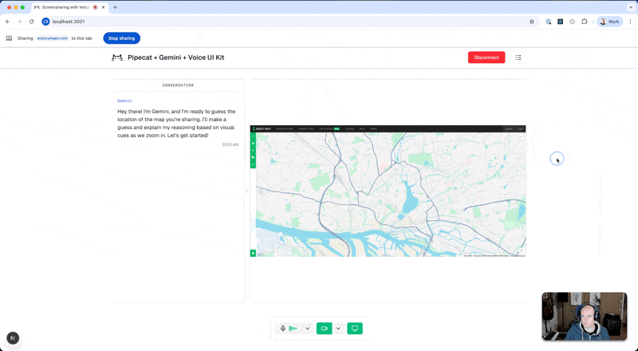

# Daily Diary - AI-Powered Photo Memory Assistant

## What is this?

Daily Diary is an intelligent photo memory assistant that combines real-time voice conversation with visual analysis. Upload photos and engage in meaningful conversations about your memories while the AI analyzes your images and asks thoughtful questions to help you reflect on your experiences.

## Demo Video

*Less than 60 seconds demo showing photo upload, AI analysis, and voice conversation about memories*

## How Gemini models and Pipecat used

**Gemini Integration:**
- **Gemini 2.5 gemini-2.5-flash-native-audio** for real-time voice conversations via Pipecat's Gemini Live integration
- **Gemini 2.0 Flash Experimental** for intelligent photo analysis, generating empathetic responses about user memories
- Custom prompts designed for emotional understanding and memory exploration

**Pipecat Integration:**
- Real-time WebRTC voice communication through Daily.co transport
- Custom pipeline handling photo uploads and analysis results
- Voice UI Kit components for polished user experience

## Other tools used

- **AWS S3**: Secure photo storage with presigned URL uploads
- **Daily.co**: WebRTC infrastructure for real-time communication

## What we built new during the hackathon

**New Features Added:**
1. **Photo Upload Component** (`client/app/components/PhotoUpload.tsx`) - S3 integration with drag-and-drop interface
2. **Photo Display Component** (`client/app/components/PhotoDisplay.tsx`) - Shows uploaded photos alongside conversation
3. **Image Analysis Module** (`server/image_analyzer.py`) - Gemini-powered photo analysis for emotional understanding
4. **S3 Manager** (`server/s3_manager.py`) - Handles secure photo storage and retrieval
5. **Upload API** (`client/app/api/upload/route.ts`) - Generates presigned URLs for secure uploads
6. **Memory-focused prompts** - Custom AI prompts designed for empathetic memory exploration

**Built on top of:** The base Pipecat + Gemini Live integration example, adding photo analysis and memory conversation capabilities.

## Feedback on tools used

**Gemini Live API:**
- **Excellent**: Natural conversation flow with minimal latency
- **Great**: Easy integration with Pipecat's existing infrastructure
- **Suggestion**: More examples of custom prompt engineering for specific use cases

**Pipecat:**
- **Loved**: Voice UI Kit components saved significant development time
- **Challenge**: Handling Conversation Frame was complicated and I was not able to complete it 

## Project structure

- `client/`: Next.js app with Voice UI Kit components and resizable layout
- `server/`: Python bot integrating Gemini with Pipecat

